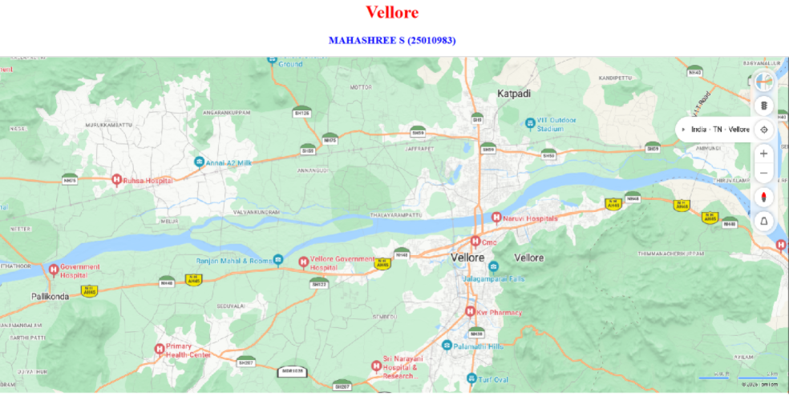
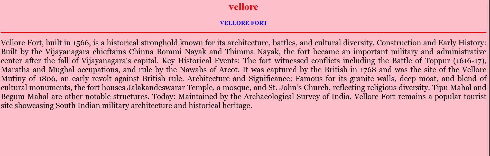
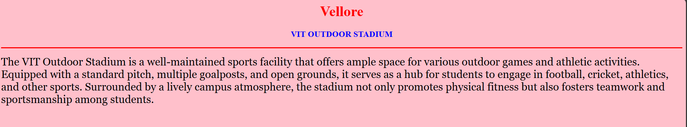
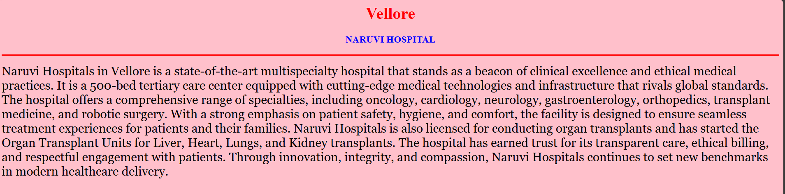
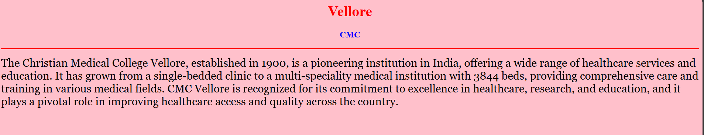
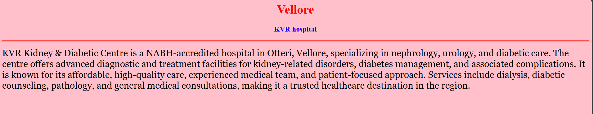

# Ex03 Places Around Me
## Date:24.11.2025

## AIM
To develop a website to display details about the places around my house.

## DESIGN STEPS

### STEP 1
Create a Django admin interface.

### STEP 2
Download your city map from Google.

### STEP 3
Using ```<map>``` tag name the map.

### STEP 4
Create clickable regions in the image using ```<area>``` tag.

### STEP 5
Write HTML programs for all the regions identified.

### STEP 6
Execute the programs and publish them.

## CODE
```
<html>

<head>

<title>My City</title>

</head>

<body>

<h1 align="center">

<font color="red"><b>Vellore</b></font>

</h1>

<h3 align="center">

<font color="blue"><b>MAHASHREE S (25010983)</b></font>

</h3>

<center>



<map name="MyCity">

  <area target="" alt="" title="my home town" href="home.html" coords="869,289,1415,626" shape="rect">
    <area target="" alt="" title="VIT outdoor stadium" href="stadium.html" coords="1265,164,111" shape="circle">
    <area target="" alt="" title="Naruvi hospital" href="naruvi.html" coords="1191,377,1252,358,1247,396,1199,403,1163,390" shape="poly">
    <area target="" alt="" title="CMC" href="cmc.html" coords="1136,435,33" shape="circle">
    <area target="" alt="" title="kvr hospital" href="kvr.html" coords="1096,538,1267,633" shape="rect">
</map>

</center>

</body>

</html>

home.html

<html>

<head>
<title>My Home Town</title>
</head>
<body bgcolor="pink">
<h1 align="center">
<font color="red"><b>vellore</b></font>
</h1>
<h3 align="center"> 
<font color="blue"><b>VELLORE FORT</b></font>
</h3>
<hr size="3" color="red">
<p align="justify">
<font face="Georgia" size="5">
Vellore Fort, built in 1566, is a historical stronghold known for its architecture, battles, and cultural diversity.
Construction and Early History: Built by the Vijayanagara chieftains Chinna Bommi Nayak and Thimma Nayak, the fort became an important military and administrative center after the fall of Vijayanagara's capital.

Key Historical Events: The fort witnessed conflicts including the Battle of Toppur (1616-17), Maratha and Mughal occupations, and rule by the Nawabs of Arcot. It was captured by the British in 1768 and was the site of the Vellore Mutiny of 1806, an early revolt against British rule.
Architecture and Significance: Famous for its granite walls, deep moat, and blend of cultural monuments, the fort houses Jalakandeswarar Temple, a mosque, and St. John’s Church, reflecting religious diversity. Tipu Mahal and Begum Mahal are other notable structures.
Today: Maintained by the Archaeological Survey of India, Vellore Fort remains a popular tourist site showcasing South Indian military architecture and historical heritage.

</p>
</body>
</html>

stadium.html

<html>
<head>
<title>My Home Town</title>
</head>
<body bgcolor="pink">
<h1 align="center">
<font color="red"><b>Vellore</b></font>
</h1>
<h3 align="center"> 
<font color="blue"><b>VIT OUTDOOR STADIUM</b></font>
</h3>
<hr size="3" color="red">
<p align="justify">
<font face="Georgia" size="5">
</p>
The VIT Outdoor Stadium is a well-maintained sports facility that offers ample space for various outdoor games
 and athletic activities. Equipped with a standard pitch, multiple goalposts, and open grounds, it serves as a 
 hub for students to engage in football, cricket, athletics, and other sports. Surrounded by a lively campus
 atmosphere, the stadium not only promotes physical fitness but also fosters teamwork and sportsmanship among 
 students.
</body>
</html>

naruvi.html

<html>
<head>
<title>My Home Town</title>
</head>
<body bgcolor="pink">
<h1 align="center">
<font color="red"><b>Vellore</b></font>
</h1>
<h3 align="center"> 
<font color="blue"><b>NARUVI HOSPITAL</b></font>
</h3>
<hr size="3" color="red">
<p align="justify">
<font face="Georgia" size="5">
</p>
Naruvi Hospitals in Vellore is a state-of-the-art multispecialty hospital that stands as a beacon of 
clinical excellence and ethical medical practices. It is a 500-bed tertiary care center equipped with 
cutting-edge medical technologies and infrastructure that rivals global standards. The hospital offers a 
comprehensive range of specialties, including oncology, cardiology, neurology, gastroenterology, orthopedics,
transplant medicine, and robotic surgery. With a strong emphasis on patient safety, hygiene, and comfort, the 
facility is designed to ensure seamless treatment experiences for patients and their families. Naruvi Hospitals 
is also licensed for conducting organ transplants and has started the Organ Transplant Units for Liver, Heart,
Lungs, and Kidney transplants. The hospital has earned trust for its transparent care, ethical billing, and
respectful engagement with patients. Through innovation, integrity, and compassion, Naruvi Hospitals continues
to set new benchmarks in modern healthcare delivery.
</body>
</html>

cmc.html

<html>
<head>
<title>My Home Town</title>
</head>
<body bgcolor="pink">
<h1 align="center">
<font color="red"><b>Vellore</b></font>
</h1>
<h3 align="center"> 
<font color="blue"><b>CMC</b></font>
</h3>
<hr size="3" color="red">
<p align="justify">
<font face="Georgia" size="5">
</p>
The Christian Medical College Vellore, established in 1900, is a pioneering institution in India, offering a 
wide range of healthcare services and education. It has grown from a single-bedded clinic to a multi-speciality 
medical institution with 3844 beds, providing comprehensive care and training in various medical fields. CMC 
Vellore is recognized for its commitment to excellence in healthcare, research, and education, and it plays a
 pivotal role in improving healthcare access and quality across the country.
</body>
</html>

kvr.html

<html>
<head>
<title>My Home Town</title>
</head>
<body bgcolor="pink">
<h1 align="center">
<font color="red"><b>Vellore</b></font>
</h1>
<h3 align="center"> 
<font color="blue"><b>KVR hospital</b></font>
</h3>
<hr size="3" color="red">
<p align="justify">
<font face="Georgia" size="5">
</p>
KVR Kidney & Diabetic Centre is a NABH-accredited hospital in Otteri, Vellore, specializing in nephrology, 
urology, and diabetic care. The centre offers advanced diagnostic and treatment facilities for kidney-related 
disorders, diabetes management, and associated complications. It is known for its affordable, high-quality care, 
experienced medical team, and patient-focused approach. Services include dialysis, diabetic counseling, pathology,
 and general medical consultations, making it a trusted healthcare destination in the region.
</body>
</html>
```


## OUTPUT








## RESULT
The program for implementing image maps using HTML is executed successfully.
